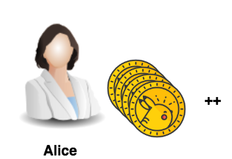

Now as we configured the library to use this particular key of Alice (which was pre-configured together with the account in the genesis block), she can send commands to the system. 

This next snippet defines a list of commands that will be wrapped into a transaction and sent to Iroha. 
With `AddAssetQuantity` command Alice will issue a certain amount of the asset `coin#test`. 

You can wrap other commands into transactions - full list of commands and queries can be found in [Iroha docs](https://iroha.readthedocs.io/en/latest/api/index.html). 
There you can also find parameters that need to be transferred along with certain commands.

So, as Alice has all of the permissions, she also has a permission called `can_add_asset_qty` - it allows her to issue coins (basically, creating money out of thin air):

<pre class="file" data-filename="add-asset-quantity.py" data-target="replace">
#!/usr/bin/env python3.7

import client

@client.trace
def send():  
  commands = [    
    client.iroha.command('AddAssetQuantity', asset_id='coin#test', amount='50000.00')
  ]
  tx = client.iroha.transaction(commands, quorum=1)
  client.IrohaCrypto.sign_transaction(tx, client.alice_private_key)
  client.send_transaction_and_print_status(tx)

send()
</pre>
