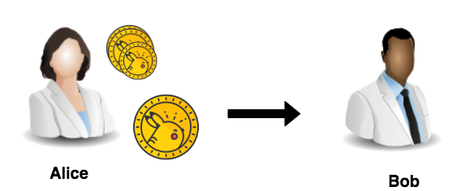

Let's create another file. 
Now for transferring the assets that were created during the previous transaction:

`touch transfer-assets.py`{{execute}}

And open it:

`transfer-assets.py`{{open}}

It contains a command that transfers some asset quantity from Alice to Bob:

<pre class="file" data-filename="transfer-assets.py" data-target="replace">
#!/usr/bin/env python3.7

import client

@client.trace
def send():  
  commands = [    
    client.iroha.command('TransferAsset', src_account_id='alice@test', dest_account_id='bob@test', asset_id='coin#test',
      amount='1.00')
  ]
  tx = client.iroha.transaction(commands, quorum=1)
  client.IrohaCrypto.sign_transaction(tx, client.alice_private_key)
  client.send_transaction_and_print_status(tx)

send()
</pre>

Now, when the command is ready, let us execute the script:

`python3.7 transfer-assets.py`{{execute}}
