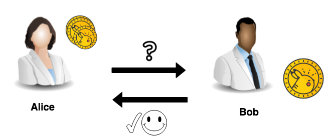

Let's make sure that Bob received our transfer by sending a query about his account balance.

As usual, by creating another file:

`touch get-account-assets.py`{{execute}}

And opening it:

`get-account-assets.py`{{open}}

Copy the snippet. 

It will execute a command that queries Bob's balance. 
Note that the command is executed on behalf of Alice's account. That is possible since she has `can_get_all_txs` permission.

<pre class="file" data-filename="get-account-assets.py" data-target="replace">
#!/usr/bin/env python3.7

import client

@client.trace
def send():
  query = client.iroha.query('GetAccountAssets', account_id='bob@test')
  client.IrohaCrypto.sign_query(query, client.alice_private_key)
  response = client.net.send_query(query)
  data = response.account_assets_response.account_assets
  for asset in data:
    print('Asset id = {}, balance = {}'.format(
      asset.asset_id, asset.balance))

send()
</pre>

Execute the script and verify that Bob's account balance is `1.00`:

`python3.7 get-account-assets.py`{{execute}}
